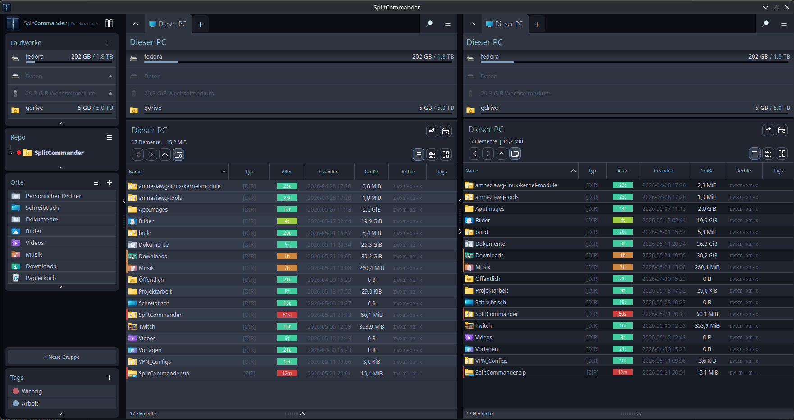
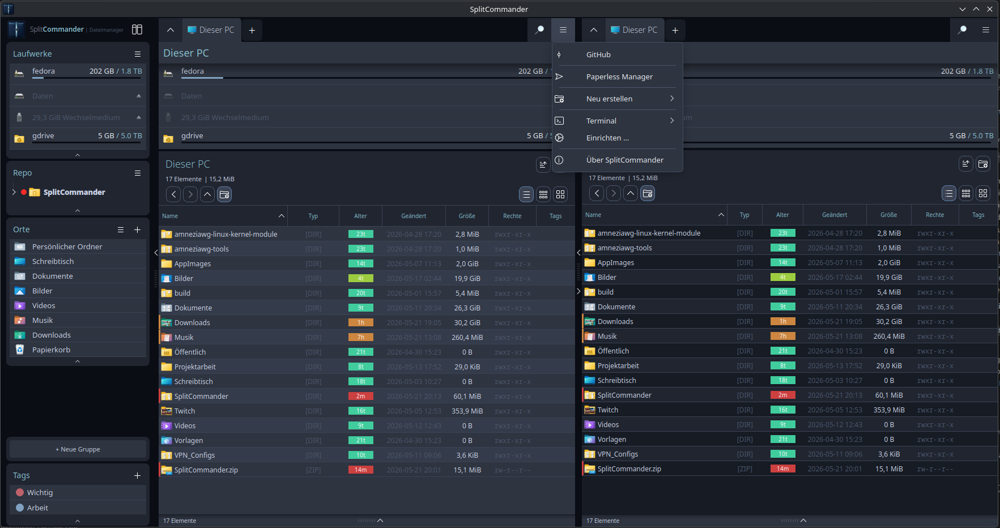
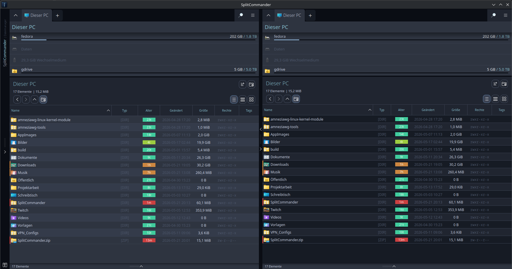
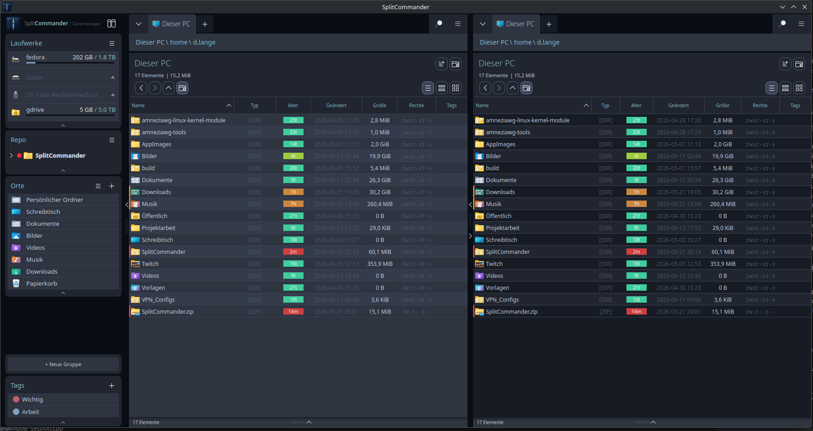

<div align="center">
  
  <br/><br/>

  [](LICENSE)
  [](https://www.qt.io/)
  [](https://api.kde.org/frameworks/)
  []()

</div>

---

### 📸 Screenshots & Gallery / Galerie

<details open>
<summary><b>Click to expand / Zum Aufklappen anklicken</b></summary>
<br/>

| 🔵 Nord Theme & Miller Columns | 🎨 Theme Creator & Tagging |
| :---: | :---: |
|  <br/> *SplitCommander main window layout* |  <br/> *Miller Columns & custom file tagging* |

| 📦 Native Qt6 Installer Wizard | 📂 Custom Sidebar Groups & Casing |
| :---: | :---: |
|  <br/> *Graphical setup wizard with custom plugin choices* |  <br/> *Wider, readable dialogs & centered sidebar elements* |

</details>

---

<details open>
<summary><b>🇬🇧 English</b></summary>

## SplitCommander

A native KDE file manager with dual-pane layout, inspired by OneCommander.  
Built with Qt6 and KDE Frameworks 6.

### Features

- **Dual-pane layout** — browse two directories side by side
- **Miller columns view** — fast directory tree navigation
- **Sidebar** with drives, network mounts, bookmarks, custom groups and tags
- **Google Drive** — native integration via KIO (kio-gdrive) with quota bar
- **Network drives** — SMB, NFS, SFTP, WebDAV, MTP — add manually or auto-detected
- **Add network drive dialog** — set URL, display name and icon
- **Detail view** with configurable columns (name, type, size, date, permissions, and more)
- **Icon view** for media-rich directories
- **Tag system** — mark and filter files with colored tags
- **Shortcuts** — fully configurable (F2, F5, Del, Alt+←/→ and more)
- **Terminal integration** — open terminal in current directory
- **Batch renamer** — rename multiple files at once
- **Themes** — Nord, Catppuccin Mocha, Gruvbox Dark and KDE Global Theme support
- **KIO integration** — all file operations via KIO (copy, move, delete, symlinks, new files)
- **Drag & drop** — full KIO-based drag and drop support

### Installation

```bash
git clone https://github.com/daniell1904/SplitCommander.git
cd SplitCommander
chmod +x install.sh
./install.sh
```

Running the script automatically compiles and launches a **beautiful, native Qt6 graphical setup wizard** that guides you through the installation process and optional plugin selection (when a graphical environment is active). In headless or server environments, it gracefully falls back to interactive terminal prompts.

The script automatically detects your distribution and installs all required dependencies.

| Distribution | Package manager |
|---|---|
| Arch / CachyOS / Manjaro | pacman |
| Fedora | dnf |
| Ubuntu / Debian / Mint | apt |
| openSUSE | zypper |

**Optional flags:**
```bash
./install.sh --no-deps     # skip dependency installation
./install.sh --no-install  # build only, don't install system-wide
```

#### 📦 Flatpak (Recommended)
Build and run SplitCommander as a sandboxed Flatpak package:
```bash
flatpak-builder --force-clean --user --install build-flatpak org.github.daniell1904.SplitCommander.yml
flatpak run org.github.daniell1904.SplitCommander
```

#### 🚀 Portable AppImage
Build a fully portable, single-file executable that runs on any Linux distribution:
```bash
./build-appimage.sh
# Run it directly:
./dist/SplitCommander-x86_64.AppImage
```

#### 🏔️ Arch Linux (AUR)
If you are on Arch Linux, CachyOS, or Manjaro, you can install the development version directly from the AUR:
```bash
yay -S splitcommander-git
```

### Manual build

```bash
cmake -B build-release -S . -DCMAKE_BUILD_TYPE=Release -G Ninja
cmake --build build-release --parallel $(nproc)
sudo cmake --install build-release
```

### Dependencies

- Qt 6 — Core, Gui, Widgets, Svg, Concurrent
- KDE Frameworks 6 — KIO, Solid, IconThemes, ConfigWidgets, XmlGui, WidgetsAddons, WindowSystem, Archive, Service, I18n, Baloo
- CMake ≥ 3.18, Ninja, GCC/Clang with C++20

### Note

This project was developed with AI assistance (Claude by Anthropic).

### License

GPL-3.0 — see [LICENSE](LICENSE)

**Disclaimer:** This software is provided "as is", without warranty of any kind, express or implied. Use it at your own risk. The authors are not responsible for any data loss or damage.

</details>

---

<details>
<summary><b>🇩🇪 Deutsch</b></summary>

## SplitCommander

Ein nativer KDE-Dateimanager mit Dual-Pane-Layout, inspiriert von OneCommander.  
Gebaut mit Qt6 und KDE Frameworks 6.

### Funktionen

- **Dual-Pane-Layout** — zwei Verzeichnisse gleichzeitig im Blick
- **Miller-Columns-Ansicht** — schnelle Navigation durch Verzeichnisbäume
- **Sidebar** mit Laufwerken, Netzwerklaufwerken, Lesezeichen, Gruppen und Tags
- **Google Drive** — direkte Integration über KIO (kio-gdrive) mit Speicherbalken
- **Netzwerklaufwerke** — SMB, NFS, SFTP, WebDAV, MTP — manuell hinzufügen oder automatisch erkannt
- **Netzlaufwerk-Dialog** — URL, Anzeigename und Symbol frei wählbar
- **Detailansicht** mit konfigurierbaren Spalten (Name, Typ, Größe, Datum, Rechte u.v.m.)
- **Icon-Ansicht** für medienreiche Verzeichnisse
- **Tag-System** — Dateien mit farbigen Tags markieren und filtern
- **Shortcuts** — vollständig konfigurierbar (F2, F5, Entf, Alt+←/→ u.v.m.)
- **Terminal-Integration** — Terminal im aktuellen Verzeichnis öffnen
- **Batch-Umbenenner** — mehrere Dateien gleichzeitig umbenennen
- **Themes** — Nord, Catppuccin Mocha, Gruvbox Dark sowie KDE Global Themes
- **KIO-Integration** — alle Dateioperationen über KIO (Kopieren, Verschieben, Löschen, Symlinks, neue Dateien)
- **Drag & Drop** — vollständiges KIO-basiertes Drag & Drop

### Installation

```bash
git clone https://github.com/daniell1904/SplitCommander.git
cd SplitCommander
chmod +x install.sh
./install.sh
```

Das Ausführen des Skripts kompiliert und startet automatisch einen **wunderschönen, nativen Qt6-Grafik-Installer**, der dich komfortabel durch die Einrichtung und Plugin-Auswahl führt (sofern eine grafische Oberfläche aktiv ist). Auf Servern oder SSH-Verbindungen schaltet das Skript automatisch auf eine interaktive Terminal-Abfrage um.

Das Script erkennt automatisch die Distribution und installiert alle Abhängigkeiten.

| Distribution | Paketmanager |
|---|---|
| Arch / CachyOS / Manjaro | pacman |
| Fedora | dnf |
| Ubuntu / Debian / Mint | apt |
| openSUSE | zypper |

**Optionale Flags:**
```bash
./install.sh --no-deps     # Abhängigkeiten überspringen
./install.sh --no-install  # Nur bauen, nicht systemweit installieren
```

#### 📦 Flatpak (Empfohlen)
Du kannst SplitCommander als isoliertes Flatpak-Paket bauen und installieren:
```bash
flatpak-builder --force-clean --user --install build-flatpak org.github.daniell1904.SplitCommander.yml
flatpak run org.github.daniell1904.SplitCommander
```

#### 🚀 Portables AppImage
Erstelle eine portable, eigenständige ausführbare Datei, die auf jeder Distribution läuft:
```bash
./build-appimage.sh
# Direkt starten:
./dist/SplitCommander-x86_64.AppImage
```

#### 🏔️ Arch Linux (AUR)
Nutzer von Arch Linux, CachyOS oder Manjaro können die Entwicklungsversion direkt aus dem AUR installieren:
```bash
yay -S splitcommander-git
```

### Manueller Build

```bash
cmake -B build-release -S . -DCMAKE_BUILD_TYPE=Release -G Ninja
cmake --build build-release --parallel $(nproc)
sudo cmake --install build-release
```

### Abhängigkeiten

- Qt 6 — Core, Gui, Widgets, Svg, Concurrent
- KDE Frameworks 6 — KIO, Solid, IconThemes, ConfigWidgets, XmlGui, WidgetsAddons, WindowSystem, Archive, Service, I18n, Baloo
- CMake ≥ 3.18, Ninja, GCC/Clang mit C++20

### Hinweis

Dieses Projekt wurde mit Unterstützung von KI (Claude von Anthropic) entwickelt.

### Lizenz

GPL-3.0 — siehe [LICENSE](LICENSE)

**Haftungsausschluss:** Diese Software wird „wie besehen" zur Verfügung gestellt, ohne jegliche Gewährleistung. Die Nutzung erfolgt auf eigene Gefahr. Die Autoren haften nicht für Datenverlust oder Schäden.

</details>
